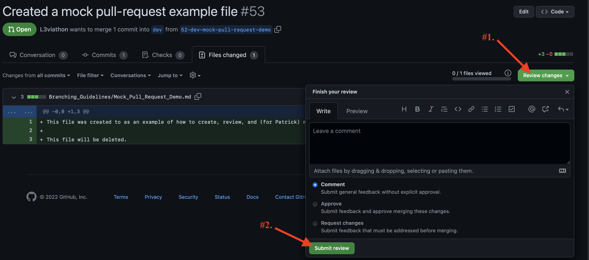

# Branching Guidelines

### Steps:
1. (If you haven't done so yet) git clone our repos into your local repository.
    - `git clone https://github.com/Revature-Leafbound/Leafbound-API.git`
    - `git clone https://github.com/Revature-Leafbound/Leafbound.git`
2. (Get in the habit of always doing this before you start coding.) You should be in the `dev` branch. `git pull`.
    - This is to make sure that your `dev` branch is up to date. For more information, click [here](#git-pull)
3. Create a branch from your assigned issue. Details can be found [here](#creating-a-branch-for-your-assigned-issue)
4. As soon as you're done creating your branch, create a draft pull request. Click [here](#creating-a-draft-pull-request) for more details.
5. If you're working on a branch, and changes were made to dev...
    - After you've done a `git pull` in your local repo on the dev branch, switch to your branch and do a `git merge dev`. For details, click [here](#if-you-created-a-branch-and-updates-in-dev-were-made-merge)
6. When you're finished with your code, navigate back to your pull request and select "**Ready to review**". Remember to assign your *team lead, Calvin, and Levi* as Reviewers. Team Leads will go through and review your code, makde any comments or suggestions, and will have a merge party to merge your code into our dev branch!

### Important Reminders:
1. NEVER make changes IN `dev`. NEVER *merge* your code into `dev`.
    - `git switch (your branch based on the issue you're working on)`
2. Remember to always start of by doing a `git pull` in dev. Then switching to your branch (`git switch (your branch)`) and doing a `git merge dev`.
3. ALWAYS create your branch from your assigned issue. If one isn't made, reach out to Levi, Jorge A., or Jose (depending on whoever's on your team).
4. Feel free to reach out if you have any questions!

### Team Leads:
- [Changing base branch to feature branch on pull requests](#changing-base-branch-to-feature-branch)
- [Reviewing Pull Requests](#reviewing-pull-requests)

 

### git pull
1. Confirm you're in the _dev_ branch. If not, `git commit` or `git stash` your changes in the branch you're in, and `git switch dev` (switch your branch to dev).
3. `git pull`.
    - This will fetch and download content from a remote repository and immediately update the local repository to match that content.

 
 

### Creating a branch for your assigned issue
1. Navigate to the Issues tab.

2. Select the Issue that you've been assigned to and want to work on.

3. (That specific issue should now be opened). Go to Development. Click on "Create a branch".

4. You should see something like this:

- You don't need to change any settings. Just select **"Create branch."**

5. Copy and paste the following code into your terminal. (Make sure you have pulled (`git pull`) in our dev branch so you're up to date on our most recent changes first!)

6. When you created your branch, your issue should look sometthing like this:

- Your branch should be under Development.
 

### Creating a draft pull request
> *Pull requests let you tell others about changes you've pushed to a branch in a repository on GitHub. Once a pull request is opened, you can discuss and review the potential changes with collaborators and add follow-up commits before your changes are merged into the base branch.*

1. As soon as you have finished creating your branch, make a small change in the code for the issue you've been assigned to and create a draft pull request.
    - Ex: If I've been assigned to the Service Layer of the User table, go to that UserService.java (for example) and make a small change (like `@Author Levi`). This change is just enough to commit your work and create a pull request.
2. Make sure to save your work. (Only one file should be changed by now).
    1. `git add (file name)` or `git add .` (if you're ready to commit everything)
    2. `git commit -m "(your_message)". Please make this message as descriptive as possible.
    3. `git push`
3. Awesome work! Now... navigate to our GitHub remote repository.
4. You should see the following:

5. Click on **Compare & Pull Request**
6. You should see the following:

    - *Reviewers*: Please do not assign reviewers until your work is ready to be reviewed (you're finished). When it is, assign your team lead, Calvin, and Levi as reviewers.
    - *Assignee*:  Yourself
    - *Labels*: This will match your issue label.
    - *Projects*: P3: Leafbound (seting this will update our project board)
    - *Milestones*: Will match your issue
7. Add any comments you want to make.
8. Click **Create pull request**. You have no created a pull request!
9. **IMPORTANT:** You need to indicate that your pull request is a draft. Navigate back to "Reviewers" inside the Pull Request you just made and click on **Convert to draft**.

10. (You should now see the following) Select **Convert to draft**

11. Yay! To confirm that this is actually a draft, you should see something like the following on your pull request.

12. When you're finished with your code, navigate back to your pull request and select "**Ready to review**". Remember to assign your *team lead, Calvin, and Levi* as Reviewers.
13. You're all set! Team Leads will go through and review your code, makde any comments or suggestions, and will have a merge party to merge your code into our dev branch!

 

### If you created a branch, and updates in dev branch were made... merge.
1. Save and `git commit` or `git stash` your work on the branch you're working on.
2. `git switch dev`
3. `git pull`.
4. `git switch (branch you want to keep working on)` : Return to the branch you're working on.
5. `git merge dev` -> (if needed) `:wq`
    - This will merge the updates from the dev branch to the branch that you're currently in so that you can work with the most recent changes.
 

### If you created a branch, and updates in the feature branch were made... merge.
1. Save and `git commit` or `git stash` your work on the branch you're working on.
2. `git switch feature-branch-name`
3. `git pull`.
4. `git switch (branch you want to keep working on)` (this will return you to the branch you're working on.)
5. `git merge feature-branch-name` -> (if needed) `:wq`
    - This will merge the updates from the feature branch to the branch that you're currently in so that you can work with the most recent changes.

 

### How to mark or ask for help using Github
- Using pull requests labels and comments
- be specific
 

## For Team Leads
### Changing base branch to feature branch:
Individual branches -> Feature branches -> Dev -> Main  
1. Go to your team member's specific pull request

2. Select **Edit** on the right hand side.
3. Change the "**base: dev**" to your feature branch.
4. Select **Save**.

When you go ahead and merge your team's work, it should now merge into your feature branch.

 

### Reviewing Pull Requests
1. When a team member creates a pull request, and assigns you as a reviewer, you will
    1. receive an email notification and
    2. will have a notification near the top of your screen when you access our Leafbound-API/Leafbound remote repo.
2. Go to that pull request.
    - If there is an icon at the top of your screen that asks you to review changes, select it. Otherwise...
3. In that pull request (which you have been assigned to review), go to the "Files Changed" tab.

4. Review the files.

    - **Red highlight** = what was changed ; **Green highlight** = New changes
    - While reviewing, if you notice a mistake or want to comment on a specific line, hover over that line and select the blue plus symbol (on the left side of your screen) to "Add a Comment" or "Start a review".
        - **Start a review**: Use this when you have several files to review with multiple comments. The notifications the assignee will receive (when you're done reviewing) will compile all of your review comments into a single email, instead of an emailing the assignee for every single comment.
5. Once you're finished reviewing, select "Review changes" at the top right corner of your screen.

- Write any overarching comments you have and either "**Approve**" or "**Request changes**".
    - *Approve* if all of the changes that were made are good to go.
    - *Request changes* if changes need to be made.
6. Remember to select "**Submit review**" to complete your review.